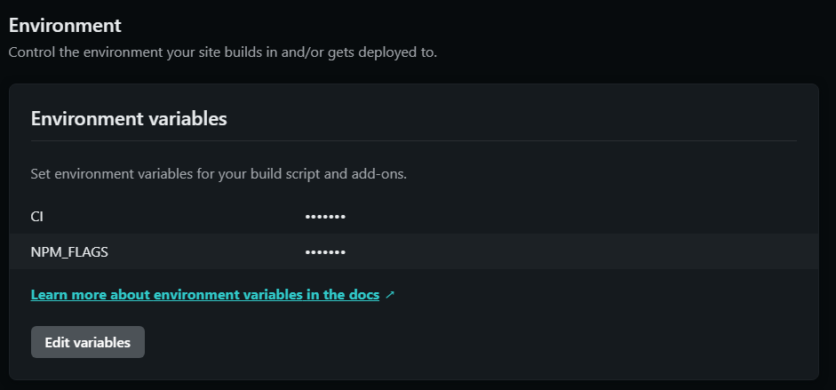
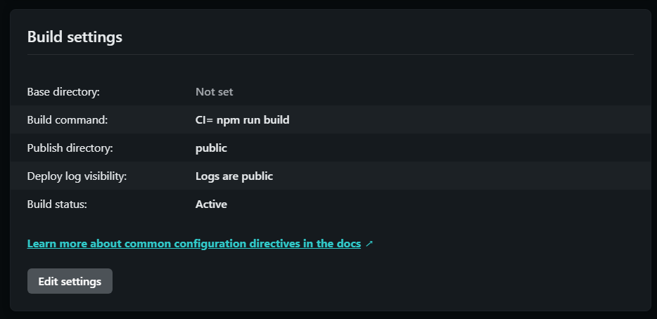

방치되다시피 한 넷리파이 기술 블로그에 post 작성 할일이 생겨 오랜만에

Markdown을 작성하고 commit and push를 했다.

## 하지만 오류가 났다....
(왜...why...나 진짜 오랜만에 마크다운 작성해서 기분좋게 커밋 하고 푸시했는데..왜..)

# netlify deploy error
***

유투브에서 개발 강의 보다가 봤다.

개발자는 문제 해결 능력이 중요하다고,

이렇게 아래와 같은 문제를 직면했다.

```
...
4:26:40 PM: Installing NPM modules using NPM version 7.6.0
4:26:52 PM: npm ERR! code ERESOLVE
4:26:52 PM: npm ERR! ERESOLVE unable to resolve dependency tree
4:26:52 PM: npm ERR!
4:26:52 PM: npm ERR! Found: react@17.0.2
4:26:52 PM: Creating deploy upload records
4:26:52 PM: npm ERR! node_modules/react
4:26:52 PM: npm ERR!   react@"^17.0.1" from the root project
4:26:52 PM: npm ERR!   peer react@"^17.0.0 || ^18.0.0" from @mui/icons-material@5.10.9
4:26:52 PM: npm ERR!   node_modules/@mui/icons-material
4:26:52 PM: npm ERR!     @mui/icons-material@"^5.1.0" from the root project
4:26:52 PM: Failed during stage 'building site': Build script returned non-zero exit code: 1 (https://ntl.fyi/exit-code-1)
4:26:52 PM: npm ERR!   20 more (@mui/material, react-dom, gatsby, ...)
4:26:52 PM: npm ERR!
4:26:52 PM: npm ERR! Could not resolve dependency:
4:26:52 PM: npm ERR! peer react@"0.0.0-experimental-c8b778b7f-20220825" from react-server-dom-webpack@0.0.0-experimental-c8b778b7f-20220825
4:26:52 PM: npm ERR! node_modules/gatsby/node_modules/react-server-dom-webpack
4:26:52 PM: npm ERR!   react-server-dom-webpack@"0.0.0-experimental-c8b778b7f-20220825" from gatsby@4.24.6
4:26:52 PM: npm ERR!   node_modules/gatsby
4:26:52 PM: npm ERR!     gatsby@"^4.9.3" from the root project
4:26:52 PM: npm ERR!     24 more (gatsby-plugin-advanced-sitemap, ...)
4:26:52 PM: npm ERR!
4:26:52 PM: npm ERR! Fix the upstream dependency conflict, or retry
4:26:52 PM: npm ERR! this command with --force, or --legacy-peer-deps
4:26:52 PM: npm ERR! to accept an incorrect (and potentially broken) dependency resolution.
4:26:52 PM: npm ERR!
4:26:52 PM: npm ERR! See /opt/buildhome/.npm/eresolve-report.txt for a full report.
4:26:52 PM: npm ERR! A complete log of this run can be found in:
4:26:52 PM: npm ERR!     /opt/buildhome/.npm/_logs/2022-11-03T07_26_52_326Z-debug.log
4:26:52 PM: Error during NPM install
4:26:52 PM: Build was terminated: Build script returned non-zero exit code: 1
4:26:52 PM: Failing build: Failed to build site
4:26:52 PM: Finished processing build request in 30.782027089s
...
```
**일단 gatsby version 과 react 버전이 안 맞다는 얘기 인것으로 추론.**

로컬에서는 잘되는데 netlify 에 배포만 한되는 것이기 때문에 netlify 환경 설정을 위해 구글링을 열심히 해보았고,

npm run build, npm install, npm start 안될땐 무조건 아래와 같이 하고 있어서, 다시 시도했다.

 - node_modules 폴더 지우기
 - package-lock.json 파일 지우기
 - npm cache clean --force 캐시 지우기
 - npm install 다시 npm install

(다른 삽질로는 netlify.toml도 바꿔보고 peer에 나오는 버전으로 다 바꿔보았지만... 이렇게 바꿔도

또 바꾸라고 하고, 또 또 또 바꾸라고 해서 답이 나오지 않았다.ㅜㅜ)

***

로컬에서도 다시 npm install 을 했더니 비슷하게 netlify에서 찍힌 내용과 비슷하게 나왔고,

react와 gatsby 버전때문에 생긴 이슈로 파악한 뒤

--force 와 --legacy-peer-deps 옵션을 사용하면 정상적으로 설치되고, 실행됐다.

 - npm install --force : 충돌하는 부분들을 root에 설치.
 - npm install--legacy-peer-deps :  충돌하는 부분들을 무시하고 설치.

그래서 이부분을 위해 netlify 설정에서 Environment(환경이란 뜻이죵~)에 들어가서 아래와 같이 설정한다.
<style>
.gatsby-resp-image-wrapper {
    margin-left: inherit !important;
    width: 100% !important;
}
</style>


### CI = false -> CI 라는 환경변수

### NPM_FALGS = --legacy-peer-deps -> 충돌이 나도 무시 하갔다!!!


그리고 build setting 도 



### Build Command : CI= npm run build 

로 변경해주고, 

Publish directory : 도 로컬에서 npm run build 했을때 생성된 폴더명과 동일한지 잘 확인 후 (나는 public 으로 되어있는걸 확인 함) save!!!

그랬더니!!! 배포는 안됐지만 메세지는 변경되었다.

```
...
3:53:56 PM: info Total nodes: 121, SitePage nodes: 17 (use --verbose for breakdown)
3:53:56 PM: success Checking for changed pages - 0.000s
3:53:56 PM: success onPreExtractQueries - 0.000s
3:54:02 PM: success extract queries from components - 6.613s
3:54:02 PM: success write out redirect data - 0.003s
3:54:03 PM: success Build manifest and related icons - 0.614s
3:54:03 PM: success onPostBootstrap - 0.691s
3:54:03 PM: info bootstrap finished - 19.282s
3:54:03 PM: success write out requires - 0.004s
3:54:27 PM: failed Building production JavaScript and CSS bundles - 23.676s
3:54:27 PM: error Generating JavaScript bundles failed
3:54:27 PM: Can't resolve '@emotion/react' in '/opt/build/repo/node_modules/@mui/styled-engine/GlobalStyles'
3:54:27 PM: If you're trying to use a package make sure that '@emotion/react' is installed. If you're trying to use a local file make sure that the path is correct.
3:54:27 PM: error Generating JavaScript bundles failed
3:54:27 PM: Can't resolve '@emotion/react' in '/opt/build/repo/node_modules/@mui/styled-engine/StyledEngineProvider'
3:54:27 PM: If you're trying to use a package make sure that '@emotion/react' is installed. If you're trying to use a local file make sure that the path is correct.
3:54:27 PM: error Generating JavaScript bundles failed
3:54:27 PM: Can't resolve '@emotion/styled' in '/opt/build/repo/node_modules/@mui/styled-engine'
3:54:27 PM: If you're trying to use a package make sure that '@emotion/styled' is installed. If you're trying to use a local file make sure that the path is correct.
3:54:27 PM: error Generating JavaScript bundles failed
3:54:27 PM: Can't resolve '@emotion/react' in '/opt/build/repo/node_modules/@mui/styled-engine'
3:54:27 PM: If you're trying to use a package make sure that '@emotion/react' is installed. If you're trying to use a local file make sure that the path is correct.
3:54:27 PM: error Generating JavaScript bundles failed
3:54:27 PM: Can't resolve '@emotion/react' in '/opt/build/repo/node_modules/gatsby-plugin-material-ui'
3:54:27 PM: If you're trying to use a package make sure that '@emotion/react' is installed. If you're trying to use a local file make sure that the path is correct.
3:54:27 PM: not finished Running gatsby-plugin-sharp.IMAGE_PROCESSING jobs - 34.372s
3:54:27 PM: 
...
```

또 갑자기 emotion/react 가 문제인 것으로 보여,

그냥 아래와 같이 설치해주었다.

```shell
npm install @emotion/react 
npm install @emotion/styled
```
설치 후 변경된 package.json 파일을 commit 후 push 완료 했더니!!!


겨우 배포가 완료되었다.

다음번에는 더 깊이 netlify의 배포 프로세스에 대한 부분을 알아봐야 겠다.~

더더 발전하자!


배포 안되서 삽질한 흔적....

그럼 20,000;
